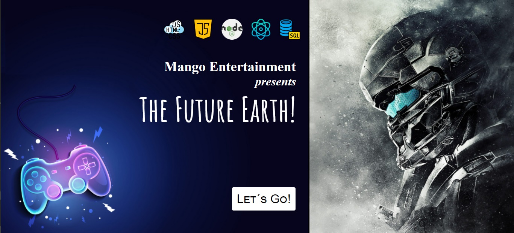
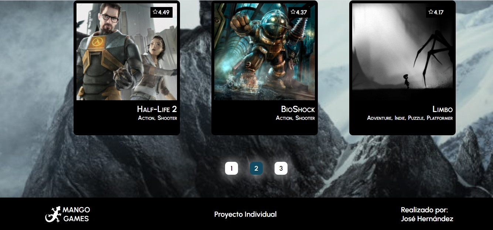

# React Project - Videogames
<p>
  
</p>

Se creó una aplicación en la cual se pueden ver los distintos videojuegos disponibles junto con información relevante de los mismos utilizando la api externa [rawg](https://rawg.io/apidocs) y a partir de ella poder, entre otras cosas:

  - Buscar videjuegos
  - Filtrarlos / Ordenarlos

__IMPORTANTE__: Para poder utilizar esta API externa fue necesario crearse una cuenta para obtener una API Key que luego debera ser incluida en todos los request que hagamos a rawg simplemente agregando `?key={YOUR_API_KEY}` al final de cada endpoint. Agregar la clave en el archivo `.env` para que la misma no se suba al repositorio por cuestiones de seguridad y utilizarla desde allí.

<p align="center">
  
</p>
<p>
   
</p>

# Home 
<p align="center">
  
</p>


## Loading
<p align="center">
  
</p>

## Pagination
<p align="center">
  
</p>
<p>
  
</p>

# Detail 
<p align="center">
  
</p>
<p>
  
</p>


# BoilerPlate

El boilerplate cuenta con dos carpetas: `api` y `client`. En estas carpetas estará el código del back-end y el front-end respectivamente.

En `api` se creó un archivo llamado: `.env` que contine la siguiente forma:

```
DB_USER=usuariodepostgres
DB_PASSWORD=passwordDePostgres
DB_HOST=localhost
DB_NAME=videogames
API_KEY=7067a80b26d94945a20876a9ddb5c8be
NODE_TLS_REJECT_UNAUTHORIZED=0
```

Reemplazar `usuariodepostgres` y `passwordDePostgres` con tus propias credenciales para conectarte a postgres. Este archivo va ser ignorado en la subida a github, ya que contiene información sensible (las credenciales).

Adicionalmente será necesario que crear desde psql una base de datos llamada `videogames`

El contenido de `client` fue creado usando: Create React App.

### Endpoints/Flags utilizados

  - GET https://api.rawg.io/api/games
  - GET https://api.rawg.io/api/games?search={game}
  - GET https://api.rawg.io/api/genres
  - GET https://api.rawg.io/api/games/{id}


#### Tecnologías usadas:
- React
- Redux
- Express
- Sequelize - Postgres

#### Frontend

Se desarrolló una aplicación en React/Redux que conteniene las siguientes pantallas/rutas.

__Pagina inicial__: se armó una landing page con
- Una imagen de fondo representativa al proyecto
- Botón para ingresar al home (`Ruta principal`)

__Ruta principal__: contiene
- Input de búsqueda para encontrar videojuegos por nombre
- Área donde se visualiza el listado de videojuegos, con el siguiente detalle:
  - Imagen
  - Nombre
  - Géneros
- Botones/Opciones para filtrar por género y por videojuego existente o agregado por nosotros
- Paginado para ir buscando y mostrando los siguientes videojuegos, 15 juegos por pagina, mostrando los primeros 15 en la primer pagina.

__Ruta de detalle de videojuego__: debe contener
- Los campos mostrados en la ruta principal para cada videojuegos (imagen, nombre, y géneros)
- Descripción
- Fecha de lanzamiento
- Rating
- Plataformas

#### Base de datos

El modelo de la base de datos contiene las siguientes entidades (Aquellas propiedades marcadas con asterísco deben ser obligatorias):

- Videojuego con las siguientes propiedades:
  - ID: * No puede ser un ID de un videojuego ya existente en la API rawg
  - Nombre *
  - Descripción *
  - Fecha de lanzamiento
  - Rating
  - Plataformas *
- Genero con las siguientes propiedades:
  - ID
  - Nombre

La relación entre ambas entidades es de muchos a muchos ya que un videojuego puede pertenecer a varios géneros en simultaneo y, a su vez, un género puede contener múltiples videojuegos distintos. Un ejemplo sería el juego `Counter Strike` pertenece a los géneros Shooter y Action al mismo tiempo. Pero a su vez existen otros videojuegos considerados como Shooter o como Action.

#### Backend

Se desarrolló un servidor en Node/Express con las siguientes rutas:

- __GET /videogames__:
  - Obtener un listado de los videojuegos
  - Debe devolver solo los datos necesarios para la ruta principal
- __GET /videogames?name="..."__:
  - Obtener un listado de las primeros 15 videojuegos que contengan la palabra ingresada como query parameter
  - Si no existe ningún videojuego se muestra un mensaje
- __GET /videogame/{idVideogame}__:
  - Obtener el detalle de un videojuego en particular
  - Trae solo los datos pedidos en la ruta de detalle de videojuego
  - Incluye los géneros asociados
- __GET /genres__:
  - Obtiene todos los tipos de géneros de videojuegos posibles
  - En una primera instancia se traen desde [api](https://api.rawg.io/api/genres) y se guardan en su propia base de datos y luego ya se hace el llamado desde allí

<p>
  
</p>